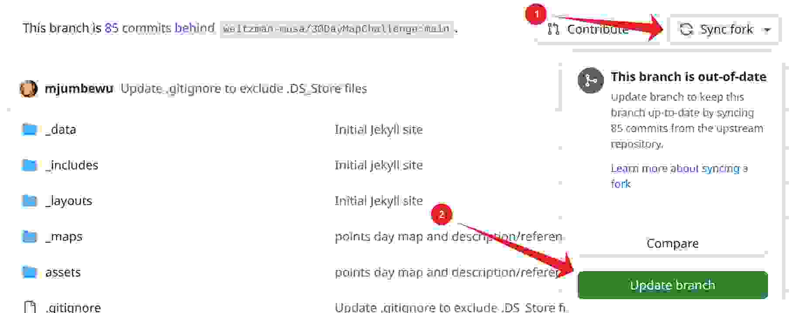

# 30DayMapChallenge
The collaborative [30-Day Map Challenge](https://30daymapchallenge.com/) entries from the MUSA program:

> The idea is to create maps based around different themes each day of November using the hashtag #30DayMapChallenge. You can prepare the maps beforehand, but the main idea is to publish maps on the dedicated days.

<!--
At the end of the month, we'll have prizes for the best map, and for the participant who completed the most maps!
-->

Find some good tips from previous participant [Wanmei Liang](https://www.linkedin.com/pulse/30daymapchallenge-reflection-wanmei-liang/).

## Participation Instructions

0.  **Create a map!**

    Refer to the daily map categories below.
    
1.  **Fork this repository**

    Note: If you have forked the repository in a previous year, you should be able to reuse the same repository; make sure to sync the latest changes into your fork:
    

2.  **Create a "thumbnail" image from your map**

    Your thumbnail should go in the **[assets/thumbnails](assets/thumbnails/)** folder for the current year, and should be a .png, .jpg, .gif, or .webp file. It should include the 2-digit day of your map, and your name in the title. For example, if I were submitting a map for November 2 in 2025, I might create a file named **assets/thumbnails/2025/02-mjumbe-poe.gif**.

    > Note that if your image is larger than 300x300, it will be scaled down, and if it is not a square, then only the middle part of the image will be visible (i.e. if it's a tall image, the top and bottom will be cropped; if it's a wide image, the left and right will be cropped). I recommend creating an image around 600 pixels on each side.

    This image will be shown in a gallery of all the maps we create for 30 Day Map Challenge. It's going to be square, and about 300 pixels on each side. Your map doesn't have to be a square -- it's just this image that going to be shown in the gallery that will be square. SO, if there's some particular part of your map that you want to showcase in the gallery, make sure to screenshot that part and use it as the thumbnail.

3.  **Create a new entry in the [_maps_2025](_maps_2025/) folder**

    Your file name should include the 2-digit day that your map is for, and your name. For example, if I were submitting a map for November 7, I would create a file named **_maps_2025/07-mjumbe-poe.md**. Use the [_maps_2025/00-template.md](_maps_2025/00-template.md) as a template for your own entry -- i.e., copy that file and name it appropriately. **Be sure to make a copy of the template file, and not just rename the original**.

    In your Markdown, you should fill out all of the fields at the top of the file. Update the `thumbnail` value to point to your thumbnail image, and update the `source` value to point to the source code that you used to generate your map. Ideally this is another Github repository where you've uploaded your source.

4.  **Open a pull request**

    In the PR title, please include your name and the challenge day. Feel free to submit your pull request early; we'll merge it in on the appropriate day.

5.  **Share your map!**

    Don't just let us know about what you created; share your work on Instagram, LinkedIn, etc. so that people know about the cool stuff you're making. Be sure to use the hashtag **#30DayMapChallenge**, and give **@weitzman_musa** a shoutout!

## Daily Map Categories

- [2025 Categories](CATEGORIES_2025.md)
- [2024 Categories](CATEGORIES_2024.md)
- [2023 Categories](CATEGORIES_2023.md)

## Code of Conduct
(as adapted from the [30-Day Map Challenge](https://30daymapchallenge.com/))

Everyone in the MUSA community is welcome to participate!

But keep in mind a few things:
- All maps you publish have to be your original work. Don’t steal content from others.
- Give credit to the original data source whenever possible.
- The challenge is all about creativity, openness and the joy of beautiful maps and cartography. It is not a competition,
- Be mindful in how you use AI tooling. If you generate all of your maps with generative AI tools, where's the fun? This is not a prompt engineering challenge.
- Don’t be an asshole. Don’t harass or steal from others.

Inspiration for the challenge came from [Inktober](https://inktober.com/) and [Tidy Tuesday](https://github.com/rfordatascience/tidytuesday).